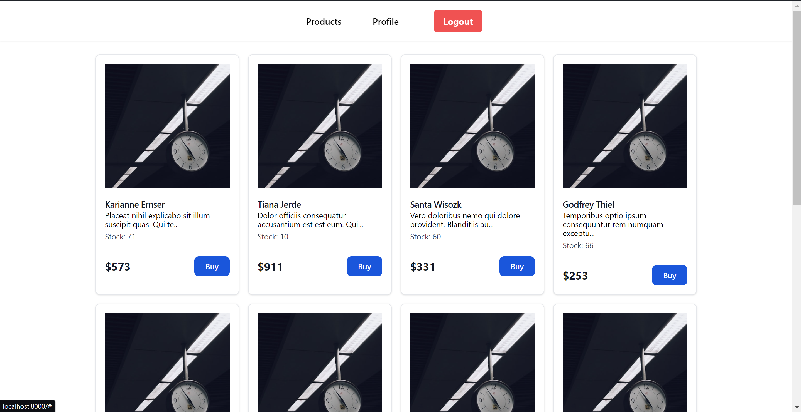
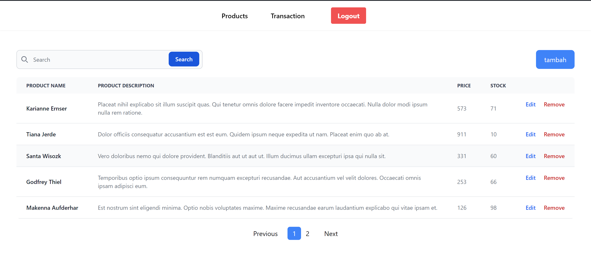

## instalasi laravel 10

-cp .env.example dan rename menjadi .env lalu setting database

-composer update

-php artisan key:generate

-php artisan migrate:fresh --seed

-php artisan serve

-npm run dev

## customer page

## seller page

